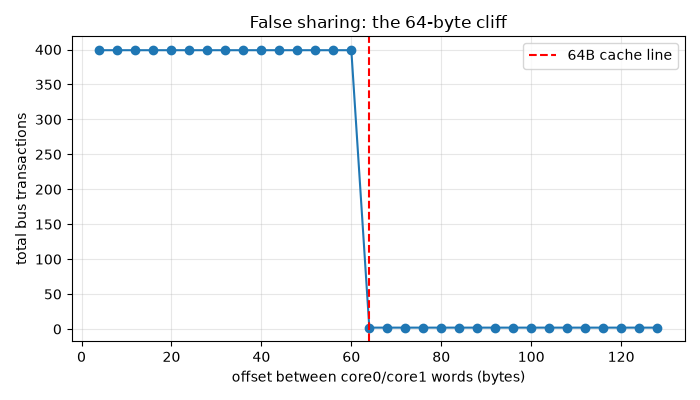
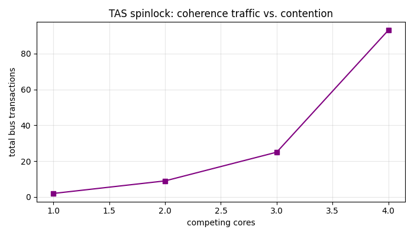
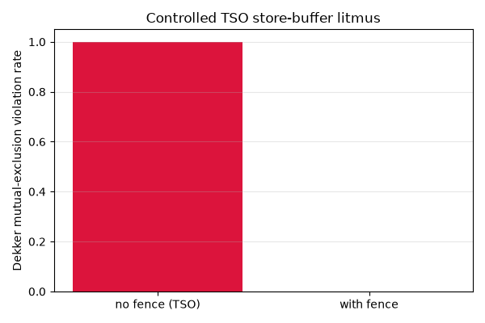

# MESI cache coherence, top to bottom

I wanted to understand what actually happens in hardware when you use
`std::atomic` or take a mutex, so I built the whole stack: the MESI protocol as
a C++ model and as synthesizable SystemVerilog, then the things you build on top
of it: hardware CAS, spinlocks, a lock-free stack, and an x86-style TSO store
buffer with the litmus tests that show why memory fences exist.

Five layers, each tested against the one below:

1. **C++ behavioral model** of MESI with a snooping bus, plus a
   sequential-consistency checker and race injection (`model/`)
2. **SystemVerilog RTL**: cache array, MESI FSM, snooping bus, 4-core system,
   lint clean (`rtl/`)
3. **Workloads** that stress specific protocol behavior: ping-pong, false
   sharing, producer/consumer, reader storm, barrier (`sim/workloads.hpp`)
4. **Atomics + sync primitives**: CAS and fetch-and-add as bus-locked RMW, then
   TAS lock, ticket lock, seqlock, hazard pointers, Treiber stack, all driven by
   real OS threads (`primitives/`)
5. **TSO store buffer** + Dekker and message-passing litmus tests
   (`model/tso.hpp`, `rtl/store_buffer.sv`)

## Contents

- [Quick start](#quick-start)
- [Results](#results)
- [Protocol scope](#protocol-scope)
- [Layout](#layout)
- [Tooling](#tooling)

## Quick start

```bash
bash run_all.sh
```

Builds and runs everything: 38 model/primitive/TSO tests, the demo runner, the
Verilator RTL testbench (58 checks), and the analysis plots. Exit 0 means all of
it passed. Needs Verilator 5.x and a C++17 g++. On Windows/MSYS2 read
[docs/BUILDING.md](docs/BUILDING.md) first, there are two PATH-related traps.

## Results

**False sharing is a 64-byte cliff.** Two cores incrementing adjacent words on
the same cache line cost 399 bus transactions per 100 iterations. Pad the words
one line apart and it drops to 2.



**Lock contention is coherence traffic.** Bus transactions per lock acquisition
grow steeply with the number of competing cores:



**TSO breaks Dekker without fences.** With the store buffer enabled, Dekker's
algorithm violates mutual exclusion 100% of the time; with MFENCE, never.



Other numbers from the counters: ping-pong writes cost one BusRdX plus one
invalidation each (200 writes → 200 BusRdX, 199 writebacks); a 4-core reader
storm ends with 4 BusRd, 0 BusRdX, all lines Shared.

One thing I got to correct along the way: message passing does *not* need a
fence under real TSO. A FIFO store buffer preserves store→store order, so the
usual textbook claim is wrong. The suite proves MP passes under FIFO TSO and
only breaks under a deliberately weakened out-of-order drain mode. Details in
[docs/DESIGN.md](docs/DESIGN.md).

## Protocol scope

States M/E/S/I with BusRd, BusRdX, BusUpgr, and BusWB transactions. The FSM
(`rtl/mesi_fsm.sv`, mirrored by `model/cache_controller.cpp`) covers every
processor- and snoop-initiated transition, including dirty intervention
(M-state writeback on a snooped read) and the BusUpgr to BusRdX race, which is
the one everybody gets wrong the first time.

Known simplifications: the RTL cache is direct-mapped with one word per line,
there's no eviction writeback, and the atomics/TSO layers run against the C++
model rather than being wired through the RTL datapath (the store buffer exists
in RTL but is unit-tested standalone). All listed with reasoning in
[docs/DESIGN.md](docs/DESIGN.md).

## Layout

```
model/        C++ behavioral model, SC checker, TSO store buffer
rtl/          SystemVerilog: FSM, cache, bus, memory, store buffer
sim/          Verilator testbench + workload library
primitives/   spinlocks, seqlock, hazard pointers, lock-free stack
analysis/     plot scripts (matplotlib, ASCII fallback)
docs/         DESIGN.md, BUILDING.md, images
```

## Tooling

Build toolchain, AI-assisted coding, and how the docs themselves were written
are covered in [TOOLING.md](TOOLING.md).
